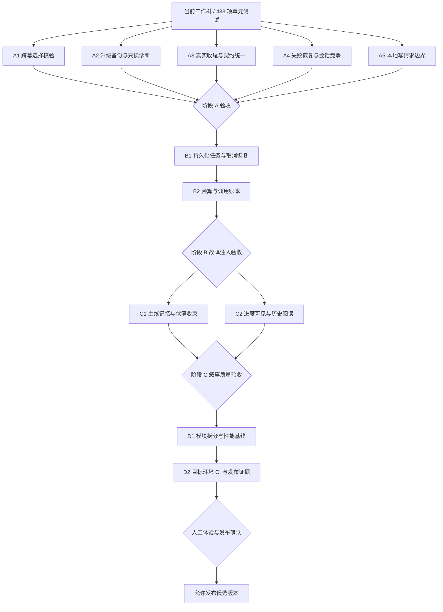

# StoryForge 稳定性与创作质量优化计划

**Goal:** 让作者每次选择准确生效、故障后可以继续、升级可恢复、模型真正完成收尾，并使消耗和发布状态可验证。

**Architecture:** 保留 Next.js + SQLite 本地单作者架构。先修复请求与事务契约，再建立 SQLite 持久化生成任务和共享调用账本；最后改进叙事记忆、界面与模块边界。

**Tech Stack:** Next.js 16、React 19、TypeScript、better-sqlite3、Zod、Vitest、Playwright。

**Spec:** [2026-09-08 深度审核](../../2026-09-08-deep-audit.md)。代码基线 `11e4580`；本工作树已完成阶段 A 核心修复、阶段 B 的核心实现和阶段 C 的结构/UI 实现，仍需真实模型质量评测、目标环境发布验证和最终人工确认。

## 约束

- 私人本地、无需登录、文字优先；默认只绑定 loopback。
- 保留作者逐幕选择、只生成选中方向、有限收尾的主流程。
- 不删除私人故事、历史记录或数据库；迁移前备份，恢复演练使用临时副本。
- 新代码修改前阅读对应 `node_modules/next/dist/docs/` 指南。
- 每项修复先写能够复现错误的测试，验证失败后再实现；每阶段独立审查和验收。
- 本计划图的阶段 A/B/C/D 是本次优化编号，不对应历史 Phase 0–5。

## 执行状态（2026-09-09）

- A1–A5 的核心代码修复已完成，新增/更新回归测试已通过。
- B1 持久化任务、B2 互动预算/账本、C1 结构化记忆和 C2 进度/历史阅读的核心代码已完成；补充了 worker 初始化保护、跨会话并发上限、JSON 备份进行中状态归一化、可见性退避、provider 凭据错误脱敏、缺失 token usage 的 unknown 预算保护、非最终幕提示词契约、高优先级伏笔保留、非最终幕结局修复、风险选项修复和 Zod 错误分类。
- D1 已完成历史列表的摘要分页接入、100/1000 会话读取基准、事务边界清单，并在生成 worker 和多 repository route 内采用显式共享数据库作用域；前端默认按 50 条加载更多。当前单元验证：`npm test` 为 86 个测试文件、433 个测试通过；`npm run test:e2e:authoring` 为 17/17；生产构建和 fake 评测已通过，真实跨进程、SQLite busy 和过期 queued 任务恢复演练也已记录。
- 新增编辑器低负担结局收尾：作者只需输入可选方向，模型生成预览，作者确认后原子写入；接口、修订冲突、结局节点限制和高级手填兼容均已覆盖。当前主流程不再要求作者填写七个结构化字段。
- 2026-09-10 真实模型结构复核补充：默认 `doubao-seed-evolving` 的 `zh-contemporary-6` 受控路径通过 6/6 幕；最终幕缺失字段或 `isEnding` 标记会进入一次有界收尾修复，超长主动/最终场景会进入有界修复，兼容模型返回的 `facts`、`threads`、`resolvedIds` 简写记忆字段，并过滤不完整的辅助记忆条目。该证据仍不替代 C1 的四维人工语义评分。
- 2026-09-10 正式 runner 复核：`npm run interactive:evaluate -- --provider live --allow-network --approve-paid-calls --fixture zh-contemporary-6` 返回 `status=passed`，`generatedTurns=6`、`endingPass=true`、`choiceContractPass=true`、`consequencePass=true`、`issueCodes=[]`；只记录脱敏结构摘要，不保存原始 prompt/response 或密钥。
- 2026-09-10 三样本当前版本复核：受控 live runner 逐样本通过 `zh-contemporary-6`（6/6）、`zh-fantasy-8`（8/8）和 `zh-suspense-16`（16/16）；三者的 ending、choice contract、risk coverage、consequence 检查均通过且 `issueCodes=[]`。该证据仍不替代四维人工语义评分。
- 2026-09-10 当前草稿校验刷新：使用同源 `Origin` 重跑 `第九档案室` 的 `structural + rule`，结果为 `allowed=true`、`generationComplete=true`、0 个阻断项和 3 个 warning（2 个 `REPEATED_PROSE`、1 个 `DEPTH_IMBALANCE`）；此前读取到的 34 条是历史持久化结果，已由当前规则结果替换。
- 2026-09-10 全量草稿校验复核：随后使用同源 API 完成 `structural + rule + ai_review`，结果仍为 `allowed=true`、`generationComplete=true`、0 个阻断项；最新结果有 6 个 warning，其中 AI 审阅包含 2 个 `ARC_UNRESOLVED` 和 1 个 `PACING`，其余为 2 个 `REPEATED_PROSE` 与 1 个 `DEPTH_IMBALANCE`。AI 审阅存在模型波动，这些提示需人工判断，不能替代四维语义评分。
- 2026-09-10 预览职责补充：只读预览页明确标注封存快照和“不会调用模型”，并提供“进入分支写作”入口；作者实际选择并生成下一幕的路径仍是 `/projects/:projectId/generate`，旧 `/play` 仅作兼容入口。
- 2026-09-09 人工流程复核：真实作者会话已完成 `8/8` 幕并成功落稿；全量结构、规则和 AI 验证返回 HTTP 200，AI 审阅无新增问题。新增修复了中文重复正文告警降噪，以及兼容模型 `warnings` 审阅响应归一化；当前唯一阻塞是落稿路径只有 1 个结局，而发布门禁要求至少 2 个结局，另有 13 条非阻塞正文重复告警待人工确认。
- 阶段 A 仍保留一项需要人工确认的内容：真实模型的语义收尾核验；受控 DeepSeek 结构评测已完成，但不能替代事实一致、伏笔回收和文风质量评分。跨来源浏览器攻击已在隔离 E2E 项目中验收。
- B1–C2 仍保留验收项：真实模型人工语义评分、真实设备可访问性和作者实走；真实进程退出/重启与短 SQLite busy 锁已用隔离子进程演练覆盖。D1 本轮边界/作用域批次已完成，D2 仍保留目标环境发布证据和人工发布确认。

## 2026-09-16 自动门禁复核

- 当前工作树重新执行 `npm run verify`：TypeScript、ESLint、`86` 个 Vitest 文件/`433` 个测试和 Next.js 生产构建全部通过。
- `npm run test:e2e:authoring`：作者端 Playwright `17/17` 通过，包含逐幕选择、旧会话恢复、焦点、跨来源写入、移动端长文本和发布流程。
- `npm run interactive:evaluate -- --provider fake` 与 `npm run authoring:evaluate -- --provider fake`：分别为 `3/3`，均 `networkRequest=false`；`npm audit --audit-level=high` 为 `0 vulnerabilities`。
- `npm run interactive:evaluate -- --provider live --dry-run`、`npm run authoring:evaluate -- --provider live --dry-run` 和 `npm run authoring:llm:smoke -- --dry-run` 均通过，均 `networkRequest=false`，未产生真实模型调用。
- 2026-09-16 有界真实 provider smoke 复核：以进程级 `OPENAI_MODEL=deepseek-v4-flash` 执行 `npm run authoring:llm:smoke`，退出码 `0`，返回 `status=passed`；仅记录脱敏指标（输入 `332`、输出 `107`、延迟 `1323ms`），未输出 API key、prompt 或原始响应。该结果只证明当前 provider 连通和结构化 brief 请求可用，不替代四维人工语义评分，也不自动关闭最终模型一致性门禁。
- 2026-09-16 逐幕审阅材料复核：以同一进程级模型运行 `interactive:evaluate` 的 `zh-contemporary-6` 单样本，退出码 `0`，`6/6` 幕通过，结局、选项契约、风险覆盖和具体后果检查均通过且 `issueCodes=[]`；已生成脱敏材料 `output/evaluations/interactive-review-zh-contemporary-6.md`。该材料供作者进行四维语义评分，不能由结构结果自动代替。
- 2026-09-16 同模型审阅材料补齐：使用相同进程级 `OPENAI_MODEL=deepseek-v4-flash` 为 `zh-fantasy-8` 和 `zh-suspense-16` 重新运行 `--save-review`，分别通过 `8/8` 和 `16/16`，结局、选项契约、风险覆盖和具体后果检查均通过且 `issueCodes=[]`；三份材料均通过敏感信息扫描。材料仍只作为人工四维评分输入，不能自动关闭语义质量门禁。
- 发现并处理备份 freshness 过期：`npm run db:authoring:checkpoint` 创建新 checkpoint，随后 `npm run db:authoring:restore-check -- --latest` 在临时副本恢复到迁移 v13 且图谱可读；复跑 `npm run authoring:doctor` 返回 `status=ok`、备份 `fresh`、SQLite 可写、完整性 `ok`、loopback-only 和 provider configured。
- `npm run package:standalone`、`npm run release:evidence` 和 `npm run package:smoke` 均通过；最新独立产物为 `2268` 个文件，`secretsIncluded=false`、`signed=false`，dry-run `destructive=false`。
- 重新启动本地开发服务后，`GET http://127.0.0.1:3202/api/health` 返回 `status=ok`、版本 `0.1.7`、SQLite 持久化且 LLM 已配置；此前拒绝连接仅是 E2E 构建结束后的服务生命周期状态。
- 本次只刷新备份和验证文档证据，没有关闭真实模型四维人工评分、真实设备验收、干净 Windows 账户安装、签名/安装包、canonical `master` 合并、标签、CI 或 GitHub Release 门禁。

## 计划图

| 阶段 | 成果 | 粗略工作量 | 前置 |
| --- | --- | --- | --- |
| A | 选择准确、迁移安全、收尾真实、恢复可操作 | 4–6 工程日 | 现有基线 |
| B | 任务能恢复、取消有效、消耗可控 | 4–6 工程日 | A |
| C | 长故事连贯，作者知道当前进度 | 3–5 工程日 | B |
| D | 模块职责可维护，发布证据匹配目标平台 | 3–5 工程日 | C |

工作量是单工程师含测试的初估，不是交付日期承诺；真实模型评测和目标机安装的等待时间另计。每阶段通过后才能开始下一阶段。

## 阶段 A：正确性与数据恢复

### A1 跨幕选择校验（审核 A01）

文件：`src/lib/interactive/api-contracts.ts`、`repository.ts`、续写 route、`interactive-player.tsx`；测试 `repository.test.ts`、`play-routes.test.ts`，新增 `e2e/authoring-stale-choice.spec.ts`。

- [x] 增加回归用例：旧幕选择提交后断言 409、无新增回合、无模型调用；当前由 repository/route 测试覆盖，专用双标签页 E2E 留作后续补强。
- [x] 将输入契约改为 `{ choiceId: string, expectedTurn: number }`；claimChoice 在同一事务内检查 `session.turn === expectedTurn`，缺失版本的旧客户端明确失败并提示刷新。
- [x] 同幕重复点击仍只产生一次调用；旧 generationToken 的完成/释放操作不得影响新 claim。
- [x] UI 冲突后重新读取场景，保留解释，不自动代替用户选择；409 回归会刷新当前场景并要求作者重新选择。
- [x] 已运行 repository/route 回归、完整单元测试和作者端 E2E；未拆分单独提交，等待统一交付确认。

### A2 升级备份与只读诊断（审核 A02/A03）

文件：`src/lib/authoring/database.ts`、`database-backup.ts`、`diagnostics.ts`；新增 `src/__tests__/authoring/migration-safety.test.ts`，扩展 `diagnostics.test.ts`。

- [x] 用临时旧版数据库写入哨兵数据，执行待迁移操作，断言备份存在、包含升级前 schema/数据，源库只迁移一次。
- [x] 备份目录不可写时断言不应用新迁移；无 pending migration 时断言不增加备份。
- [x] 去掉只覆盖零迁移历史的备份条件，保留显式禁用仅用于受控临时副本的语义。
- [x] Doctor 改为只读连接，报告缺库/待迁移，不创建或修改库；测试前后 schema/迁移表不变。
- [x] 已覆盖两次初始化、备份恢复、外键和最新迁移兼容；本轮审计与计划文档同步了恢复边界，未拆分单独提交。

### A3 真实收尾与契约统一（审核 A04/A09）

文件：`src/lib/interactive/generator.ts`、`schemas.ts`、`retry.ts`，新增 `ending-policy.ts`；扩展 `generator.test.ts`、`generator-envelope.test.ts`。

- [x] 将现有“forced ending 摘要”测试改为最终幕普通场景不能直接返回 ended 的失败用例。
- [x] 定义最终幕要求：`isEnding=true`、无 choices、非空 endingSummary；正文必须来自模型收尾结果。
- [x] 最多执行一次专门收尾修复请求；仍失败时不接受普通场景为结局，并返回可见验证错误。后续 B2 记录该修复调用。
- [x] 固定幕数下非最终幕保持选项契约，移除静默强制结局路径；prompt 与 README 的最终收尾边界已统一到当前实现。
- [x] 已覆盖最终幕错误、空结局摘要、修复失败、过早结局和三选项；真实模型语义质量仍需人工核验。

### A4 失败恢复与会话竞争（审核 A07/A08）

文件：`src/features/authoring/interactive-player.tsx`，按需抽取 `use-interactive-session.ts`；测试 `interactive-player.test.tsx`，新增恢复竞争 E2E。

- [x] 测试开场失败恢复展示 `session.lastError`，历史 failed session 有可点击的重试/新建入口。
- [x] 显式区分恢复中、生成中、等待选择、失败和完成；localStorage 不可用时退回服务端历史选择。
- [x] 每个异步操作捕获 sessionId 和请求序号；延迟响应不覆盖已切换会话，落稿结果仅更新原会话。
- [x] 用延迟 Promise 测试“续写时切换历史”“落稿时切换”“删除时请求返回”，验证 UI 与持久化结果均不串会话。
- [x] 失败消息与按钮保持中文，失败状态刷新后仍可操作；组件测试和作者端恢复流程已通过。

### A5 本地写请求边界（审核 A10）

文件：`src/proxy.ts`、`src/lib/authoring/api-contracts.ts`，新增 `request-security.ts` 与对应测试。

- [x] 明确可信本地 Host/Origin 和 CLI 无 Origin 规则，兼容现有本地脚本与部署入口。
- [x] 写操作拒绝不匹配来源；POST/PUT/PATCH 的有体 JSON 写接口拒绝非 JSON Content-Type；DELETE 等无体动作同样检查来源。
- [x] 测试本地正常请求、恶意 Origin/Host、缺失 Origin 的批准 CLI 路径、GET 导出和离线 HTML。
- [x] 浏览器跨来源验收已在隔离测试项目执行：`data:` 页面真实发起跨来源 POST，浏览器无法读取拒绝响应，直连 `Origin: null` 返回 403，项目数据保持为空。

阶段 A 门槛：以上回归通过，`npm run verify` 和 `npm run test:e2e:authoring` 通过；旧故事恢复正常，用户原库未用于故障注入。

## 阶段 B：任务与消耗治理

### B1 持久化任务（审核 A06，依赖 A1/A2/A4）

文件：`src/lib/authoring/migrations.ts`；新增 `src/lib/interactive/jobs.ts`、`worker.ts`；修改开场/续写路由、repository、retry；新增 `jobs.test.ts` 与进程重启 E2E。

- [x] 任务表记录 session、expectedTurn、choice、attempt、deadline、lease token、queued/running/succeeded/failed/canceled 状态。
- [x] 会话 claim 与任务入队原子完成；单机执行器以 2 个并发槽位领取任务，任务状态恢复依赖数据库而非网页是否打开。
- [x] 取消使任务失效并释放 claim；把 AbortSignal 传递到 Provider；迟到结果只能记账，不能覆盖场景。
- [x] 已覆盖关闭仓储后的 lease 重领、旧 lease 完成/失败竞争、取消中断、跨会话并发上限、真实跨进程退出/重启和短 SQLite busy 锁：第一个子进程认领后退出，第二个子进程在 lease 过期后恢复并完成任务；另一个子进程持有约 250ms 写锁时，认领进程在 busy_timeout 内等待后成功。
- [x] 为失败与重启制定最多 3 次任务尝试和 30 分钟截止时间；超过次数由作者明确重试，并已更新恢复手册。

### B2 预算与调用账本（审核 A05，依赖 B1）

文件：新增 `src/lib/interactive/usage.ts`，修改任务执行器、`src/lib/authoring/metrics.ts`、预算模块和指标契约。

- [x] 账本记录 taskId/attempt、model、requestId、状态、input/output tokens、latency；不存密钥或原始私人 prompt，并对错误信息脱敏截断。
- [x] 定义 `STORYFORGE_MAX_OUTPUT_TOKENS` 对单个互动会话及其重试/修复调用的上限；按 taskId/callIndex 原子预留预算，并根据可确认用量结算。
- [x] 超时和未知用量保守保留预留额并展示未知状态；不能因重试重复记账，不能把未知记作零消耗。
- [x] 汇总入口明确区分结构化生成与分支写作；已测试到限不发请求、失败未知用量、修复调用和重复完成。
- [x] 已更新 README 的预算作用域、单次上限、未知用量说明；跨路由真实模型用量仍需人工核对。

阶段 B 门槛：中断/取消/重启不会误写下一幕，调用可追溯，预算到限不再启动模型请求；完整 E2E 和恢复演练通过。

## 阶段 C：故事与作者体验

### C1 叙事记忆与质量评测（审核 A09，依赖 A3/B2）

文件：`src/lib/interactive/generator.ts`、`schemas.ts`；新增 `src/lib/interactive/story-memory.ts`；扩展 `src/lib/authoring/generation/evaluation.ts` 和 `src/scripts/authoring-evaluate.ts`。

- [x] 主线角色/目标/不可变事实独立保存；伏笔使用稳定 ID、优先级、open/resolved 状态；近期摘要使用可控长度。
- [x] 进入后段收束阶段时优先处理高优先级未解伏笔；最终幕首轮和修复请求都携带收尾约束。
- [x] 测试事实容量溢出不删除主线、重复伏笔幂等、稳定 ID 销账、长故事上下文预算稳定。
- [x] 固定 6/8/16 幕、多题材和不同风险选择的离线样本；`npm run interactive:evaluate -- --provider fake` 逐幕走完样本，检查风险序列、选项契约、状态后果和最终收尾，且不联网。
- [x] 受控真实模型结构评测已对 `zh-contemporary-6`、`zh-fantasy-8`、`zh-suspense-16` 各完成至少一次成功运行；记录了 16 幕样本一次失败、重试后通过的波动，模型为进程级覆盖的 `deepseek-v4-flash`，默认 `doubao-seed-evolving` 未被静默替换。
- [ ] 真实模型人工评测仍需检查选择后果、事实一致、伏笔回收和结局完整；已准备 [`互动真实模型审阅表`](../../release/interactive-evaluation-review.md)，结构 runner 不能替代样本版本记录和四维人工评分，也不能用 fake 结果替代。
- [ ] 提议质量门槛：无主线事实硬冲突、所有高优先级伏笔有交代；人工评分四维均至少 4/5。该数字是目标，尚无达标结论；评测消耗受 B2 预算控制。
- [ ] 最终人工评测和发布必须记录并确认同一个 `OPENAI_MODEL`；当前本地默认是 `doubao-seed-evolving`，若目标是 `deepseek-v4-flash`，需先切换并重新完成对应评测。

### C2 生成进度与历史阅读（审核 A06/A07，依赖 B1/B2）

文件：`interactive-player.tsx` 和抽取的 hooks/展示组件，`globals.css`、组件与可访问性 E2E。

- [x] 显示当前幕、耗时、尝试次数、是否排队、取消/重试状态；错误文案不能把正常生成说成“恢复上一段”。
- [x] 提供已生成幕的只读时间线与实际选择轨迹，作者能核对前文；回溯改写另作产品任务，避免覆盖历史。
- [x] 轮询按任务状态退避，页面不可见时降低频率；前台恢复后立即同步；评估 SSE 前先记录请求量和延迟。
- [x] 异步下一幕生成完成后，键盘焦点回到第一项选择；回归测试覆盖焦点不再落到页面主体。
- [x] 新回合生成后刷新作者写作路径时间线；回归测试覆盖新选择记录可见且不保留旧列表。
- [x] 生成中、场景就绪和故事结束状态提供 `aria-live` 播报；组件回归覆盖场景就绪通知。
- [x] 390px 隔离浏览器回归覆盖 1700 字符无空格场景正文，确认正文断行后文档和 body 均无横向溢出。
- [ ] 真实读屏设备、真实手机长文滚动和错误恢复仍需人工验收；自动化视口检查不能替代真实设备，且对真实模型报告观察耗时，不承诺未测的固定秒数。

阶段 C 门槛：结构回归、叙事评测、可访问性和作者亲自选择一条完整路径均通过；验证报告记录模型、样本版本和预算。

## 阶段 D：维护与发布

### D1 按事务职责拆分（依赖 B/C）

- [x] 对 `generation/repository.ts`、`authoring/repository.ts` 先画事务边界，将读查询、任务状态转换与写事务逐项拆出，保持现有公共 API；清单见 [`docs/architecture/authoring-transaction-boundaries.md`](../../architecture/authoring-transaction-boundaries.md)。现有方法已按短事务状态转换与事务外 provider 调用组织，后续只做逐批重构。
- [x] 为历史会话列表增加有界分页和摘要查询，避免逐条加载完整正文；前端默认 50 条、服务端单页上限 100 条，恢复时按 ID 读取完整正文。
- [x] 为摘要查询增加 v13 复合索引 `(project_id, updated_at, id)`；回归通过 `EXPLAIN QUERY PLAN` 确认 SQLite 采用该索引，并覆盖迁移幂等、旧库升级、空/非法游标和删除当前页后仍可继续分页。
- [x] 运行 `npm run db:interactive:benchmark`：最新一次 100/16 场景完整读取 14.18ms、201 条估算 SQL，摘要分页全量读取 1.05ms、2 条估算 SQL，首屏 0.66ms；1000/40 场景完整读取 116.09ms、2001 条估算 SQL，摘要分页全量读取 4.73ms、20 条估算 SQL，首屏 0.23ms。结果为当前机器基线，不替代多平台压测。
- [x] 数据库连接生命周期单独管理：生成 worker 和多 repository route 已采用显式共享作用域，多个 Repository 借用同一连接且只由 owner 释放；浏览器轮询仍按请求建立连接，不跨请求复用，避免未定义的全局可变连接。
- [x] 本批事务边界和连接作用域改动已通过现有事务、备份、导出回归、完整单元测试、作者端 E2E 和同机互动历史基线；后续 repository 大型拆分仍按小批次执行。

### D2 平台验证与文档发布（依赖 D1）

- [x] CI `verify` job 已纳入 `npm run interactive:evaluate -- --provider fake`，离线互动 6/8/16 幕契约会随 CI 一起执行。
- [x] `.github/workflows/ci.yml` 明确面向 `master` 的功能分支 PR 和 `workflow_dispatch` 手动验证入口；不依赖把每个临时工作树 push 到远程。
- [x] 已记录提交并推送候选的精确 SHA 与远程 CI 结果：代码修复提交 `fd76beb` 对应 run `34418237947`，最终文档同步提交 `fad001a` 对应 run `34418692175`；两次的 `verify`、`e2e-authoring`、`docker-build`、`standalone-windows` 均通过。此前失败原因与修复记录见发布验证文档。
- [x] `.github/workflows/ci.yml` 已声明 PowerShell 7.x 运行时检查、Windows runner 的 standalone/native SQLite 生命周期和 Linux Docker build/health smoke，二者分别构建，不共用原生二进制。
- [x] 已取得提交后的真实远程结果：Windows standalone/native SQLite、Linux Docker build/health 和作者端 E2E 均通过；Node.js 20 action-runtime 弃用提示为非阻塞告警。
- [x] 安装、升级失败、回滚、保留数据卸载、旧库恢复演练均使用隔离目录；本轮 package smoke、checkpoint restore-check 和 release evidence 均输出脱敏证据与校验和。
- [x] README、CHANGELOG、文档索引和发布清单已同步当前证据；未执行的环境门禁仍保持待验证。
- [ ] 作者人工走完创作流程后确认发布，随后按授权提交、推送、标签及 Release 流程执行。

## 本轮执行记录（2026-09-08）

- `npm run verify`：退出码 0；typecheck、lint、84 个测试文件/387 个测试和 Next 生产构建通过；本轮新增数据库作用域、历史摘要分页、validation 原子性、真实跨进程任务恢复、过期 queued 任务恢复、异步下一幕焦点、写作路径刷新、读屏状态播报、互动离线评测、受控 live 参数边界、provider 默认对齐、Docker 数据目录权限、provider 凭据脱敏、fake provider 可见性、真实模型结构漂移重试、历史状态同步、落稿状态同步和评测错误类别回归。
- `npx vitest run src/__tests__/interactive/process-recovery.test.ts`：退出码 0；2 个测试通过，覆盖第一个子进程认领后退出、第二个子进程在 lease 过期后恢复并完成，以及约 250ms 跨进程写锁释放后在 `busy_timeout` 内成功认领。
- `npm run test:e2e:authoring`：退出码 0；16/16 作者端流程通过，包含隔离浏览器跨来源写请求拒绝和 390px 无空格长正文断行验收。首次运行的 Windows SQLite 清理 `EPERM` 已通过有界重试修复并复跑通过。
- `npm run interactive:evaluate -- --provider fake`：退出码 0；3/3 互动样本通过，覆盖 6/8/16 幕、现实悬疑/奇幻冒险/都市惊悚和 low/medium/high 风险路径，`networkRequest=false`。
- 受控真实模型评测：以进程级 `OPENAI_MODEL=deepseek-v4-flash` 运行并获得作者授权；`zh-contemporary-6` 通过 6/6，`zh-fantasy-8` 通过 8/8，`zh-suspense-16` 首次在第 9 幕输出波动后重跑通过 16/16；三份报告均为结构化结果且 `issueCodes=[]`。这不是人工四维语义评分结论，默认 `doubao-seed-evolving` 仍需单独决定和验证。
- `npm run db:interactive:benchmark`：退出码 0；最新一次 100/16 场景完整读取 14.18ms、摘要分页全量读取 1.05ms；1000/40 场景完整读取 116.09ms、摘要分页全量读取 4.73ms，均使用临时数据库。
- `npm run package:standalone`：退出码 0；生成 `0.1.7` standalone 包。
- `pwsh -File scripts/package-smoke.ps1 -Mode Local -Root <系统临时目录>`：退出码 0；`clean-install`、`health`、`upgrade`、`failed-upgrade`、`rollback`、`uninstall-preserves-data` 全部通过，脚本清理了临时根。
- `npm run release:evidence`：退出码 0；先独立扫描 standalone 产物（2260 个文本文件、`secretFindings=0`），再生成 CycloneDX SBOM、SHA-256 清单和脱敏 manifest，`packageFileCount=2264`、`secretsIncluded=false`、`signed=false`。
- 生产运行时 smoke：退出码 0；standalone 服务使用系统临时目录中的独立 SQLite、`GENERATION_PROVIDER=fake` 和 loopback `127.0.0.1:3201` 启动，`GET /api/health` 与 `GET /api/projects` 均返回 200，服务和临时目录已清理。
- Docker 复核：`docker desktop status` 报告 `running`，`docker version`/`docker info` 在 `desktop-linux` 上成功；隔离 Compose 项目镜像构建退出码 0，修复 `docker-entrypoint.sh` 的 CRLF shebang 并用 `.gitattributes` 固定 LF 后，容器达到 `healthy`，`GET /api/health` 返回 200。测试容器、网络、卷和镜像已清理，未触碰用户容器或数据。
- `npm run db:authoring:smoke`：退出码 0；临时 SQLite 初始化、迁移幂等、项目读写和删除通过。
- `npm run db:authoring:restore-check -- --latest`：退出码 0；读取最新 checkpoint，在临时副本完成迁移 v13 和图谱可读性恢复验证，未修改默认用户数据库。
- `npm run authoring:doctor`：退出码 0；数据库完整性、迁移、写入、loopback 绑定和 provider 配置正常，最新 checkpoint 后备份 freshness 为 `fresh`。
- `npm run authoring:llm:smoke -- --dry-run`：退出码 0；模型配置 `doubao-seed-evolving` 可解析，`networkRequest=false`。
- 首次 Docker smoke 失败：容器以 255 退出，日志为 `exec /app/docker-entrypoint.sh: no such file or directory`；根因是 Windows CRLF shebang。修复后重新构建并完成容器健康检查。
- `npx vitest run src/__tests__/authoring/database-scope.test.ts src/__tests__/authoring/generation/api.test.ts src/__tests__/authoring/validation/api.test.ts src/__tests__/interactive/play-routes.test.ts src/__tests__/interactive/materialize-route.test.ts`：退出码 0；5 个文件、16 个测试通过，覆盖请求作用域借用连接、结构化生成、验证、互动续写和落稿。
- `npm run authoring:evaluate -- --provider fake`：退出码 0；3/3 样本通过，未发网络请求。
- `npm audit --omit=dev --audit-level=high` 和完整 `npm audit --audit-level=high`：均退出码 0；0 vulnerabilities。安全补丁将 Next.js 更新到 16.3.4、sharp 更新到 0.35.4，并将 Vitest 更新到 4.1.11。
- `git diff --check`：退出码 0；本轮未删除文件、未修改默认用户数据库、未提交/推送/打标签；恢复演练只使用 checkpoint 的临时副本。
- 2026-09-09 安全与环境复核：Next.js 16.3.4、sharp 0.35.4、Vitest 4.1.11、eslint-config-next 16.3.4；生产和全量依赖审计均为 0 vulnerabilities，`npm ci --dry-run --ignore-scripts` 退出码 0。更新依赖后的 `npm run verify` 为 84 个测试文件/394 个测试通过，`npm run test:e2e:authoring` 为 16/16；更新锁文件后的 Docker build/health smoke 也通过并清理隔离资源。
- 互动预算边界复核：Provider 对缺失或非法 token usage 标记 `usageConfirmed=false`；互动账本回归确认该调用保留为 `unknown`，不会以 `consumed=0` 释放预算。
- 依赖更新后的发布产物复核：`npm run package:standalone` 和 `npm run release:evidence` 均退出码 0；产物 2264 个文件、`secretsIncluded=false`、`signed=false`。
- 脚本级门禁复核：互动和结构化 fake 评测均为 3/3 且不联网；authoring DB smoke、最新 checkpoint restore-check 和 doctor 均退出码 0，迁移 v13、图谱可读、备份 fresh、SQLite 可写、loopback 和 provider 配置正常。
- 当前工作树补充复核：新增的非最终幕提示词契约、高优先级伏笔溢出保护、非最终幕结局修复、风险选项修复和 Zod 错误分类回归纳入 `npm run verify`，共 84 个测试文件/394 个测试；本轮 `npm run test:e2e:authoring` 为 16/16，独立 Docker Compose health smoke 通过并清理临时资源。
- 当前代码真实模型补充复核：`deepseek-v4-flash` 的 6/8/16 幕受控样本均通过完整路径；16 幕期间出现的风险等级缺项由 `choice-repair` 修复，最终 `16/16`、`issueCodes=[]`。该结果仍不替代人工四维语义评分。
- 生成边界回归补充：主动场景少于 2 个选项、最终幕缺少结局摘要/残留选项和最终修复仍非结局的情况均已覆盖；宽解析只用于进入有界修复，最终仍以严格场景契约为准。针对性生成器测试 10/10，全量验证为 84 个测试文件/398 个测试通过。
- 后置状态回归补充：空白 legacy 记忆条目会被 trim/filter，不再让结构化记忆合并阶段触发无意义重试；生成器新增回归覆盖，当前全量验证为 84 个测试文件/398 个测试通过。
- 记忆容量回归补充：当不可变事实已占满 20 条容量时，显式避免 `slice(-0)` 引入全部可变事实；新增边界测试覆盖，当前全量验证为 84 个测试文件/398 个测试通过。
- 真实长路径最终复核：`deepseek-v4-flash` 的 `zh-suspense-16` 在空白 legacy 记忆和不可变记忆容量修复后通过 16/16，风险序列、选择后果和模型结局契约均通过；中间失败已保留在发布验证记录，真实模型四维人工评分仍未完成。

## 2026-09-10 计划门禁复核

- `npm run verify`：退出码 `0`；TypeScript、ESLint、`86` 个 Vitest 文件/`416` 个测试和 Next.js 生产构建全部通过。
- `npm run test:e2e:authoring`：退出码 `0`；作者端 Playwright `16/16` 通过，覆盖逐幕选择、作者结局预览确认、失败恢复、发布门禁、离线播放、跨来源写请求和移动端长文本。
- `npm run interactive:evaluate -- --provider fake`：退出码 `0`；`3/3` 个 `6/8/16` 幕样本通过，`networkRequest=false`。
- `npm run authoring:evaluate -- --provider fake`：退出码 `0`；`3/3` 个结构化样本通过，`networkRequest=false`。
- `npm run interactive:evaluate -- --provider live --dry-run`：退出码 `0`；计划了 `3` 个样本但 `networkRequest=false`，未产生付费模型调用。
- 本地运行时复核：`GET /api/health` 返回 `status=ok`、版本 `0.1.7`、SQLite 持久化和 LLM 已配置；`GET /api/projects` 可读到 `1` 个隔离测试项目。服务使用系统临时目录中的独立数据库，未修改默认用户库。
- `npm run db:authoring:checkpoint`：退出码 `0`；新 checkpoint 完整性为 `ok`，随后 `npm run db:authoring:restore-check -- --latest` 退出码 `0`，临时副本迁移版本 `13` 且图谱可读；`npm run authoring:doctor` 返回 `status=ok`、备份 `fresh`、loopback-only 和 provider configured。
- `npm audit --omit=dev --audit-level=high` 与 `npm audit --audit-level=high`：均退出码 `0`，报告 `0 vulnerabilities`。
- `npm run package:standalone` 与 `npm run release:evidence`：均退出码 `0`；当前证据记录 `packageFileCount=2268`、`secretsIncluded=false`、`signed=false`。
- 顺序打包复核：停止本地开发服务后先完成 `npm run package:standalone`，再单独运行 `npm run release:evidence`；两者均退出码 `0`，独立证据仍为 `packageFileCount=2268`、`secretsIncluded=false`、`signed=false`。此前并行执行造成的文件锁失败不计入发布结论。
- `npm run package:smoke`：退出码 `0`；分发 dry-run 确认 Node 24、better-sqlite3、数据目录隔离和升级/回滚/保留数据卸载检查项，且 `destructive=false`；`npm ci --dry-run --ignore-scripts` 也退出码 `0`。
- `pwsh -File scripts/package-smoke.ps1 -Mode Local -Root <系统临时目录> -Port 3111`：退出码 `0`；`clean-install`、`health`、`upgrade`、`failed-upgrade`、`rollback`、`uninstall-preserves-data` 全部通过，临时根已由脚本清理。这是本机隔离生命周期证据，不等同于干净 Windows 账户验收。
- Docker Desktop Linux engine 在首次检查时不可连接，使用 `docker desktop start` 启动后完成隔离 Compose build/health smoke：镜像构建退出码 `0`，容器 healthy，`/api/health` 返回 `200`，SQLite 持久化正常；未注入 API key，容器 LLM 状态为 `not_configured`，不能作为 live 模型证据。隔离容器、卷、网络和镜像已清理。
- 本次复核新增并修复了最终幕缺失 `isEnding`、超长场景文本的有界修复边界，以及两个远程环境契约问题：互动生成测试显式注入 mock provider，Windows package smoke 支持受 GitHub runner 管理的 `RUNNER_TEMP` 并修正清理变量。修复后提交 `fd76beb` 的远程 CI run `34418237947` 已通过。仍未完成：真实模型四维人工评分、真实读屏/手机验收、目标环境安装证据、作者发布确认以及后续合并 master、标签和 GitHub Release。

## 2026-09-15 运行与恢复复核

- `npm run db:authoring:checkpoint`：退出码 `0`；创建新 checkpoint，完整性为 `ok`，并在 manifest 中记录 SHA-256。
- `npm run db:authoring:restore-check -- --latest`：退出码 `0`；临时副本恢复到迁移版本 `13`，图谱可读，默认作者数据库未被恢复演练修改。
- `npm run authoring:doctor`：退出码 `0`；数据库完整性正常、无待迁移、SQLite 可写、备份 freshness 为 `fresh`、仅 loopback 绑定、provider 已配置。
- `npm run interactive:evaluate -- --provider fake`：退出码 `0`；`6/8/16` 幕互动样本 `3/3` 通过且未联网。
- `npm run authoring:evaluate -- --provider fake`：退出码 `0`；结构化样本 `3/3` 通过且未联网。
- 预览职责澄清：预览页页尾新增“继续分支写作”入口并指向 canonical `/generate`，避免作者把只读快照误认为模型续写流程；组件回归先失败后修复并通过。
- 作者会话状态澄清：历史中的 `active` 会话改显示为“可继续”，并说明它只代表等待作者选择，不代表模型正在后台运行；针对状态标签和说明的回归测试已补充。
- 人工评测可执行性补充：live 单样本 runner 新增受门禁保护的 `--save-review --expected-model`，输出逐幕人工审阅 Markdown，并在网络请求前锁定评测模型；默认摘要报告、fake 和 dry-run 均不写出审阅正文。
- 历史记录可辨识性补充：列表显示最近更新时间和短记录编号，覆盖同一项目多条相同幕数会话的恢复选择；组件回归测试已通过。
- 旧互动会话兼容性补充：恢复到少于 3 个选项的历史活动场景时，作者端明确显示“旧规则会话”和新三选项规则；不改写历史正文，也不在提示阶段额外调用模型。读取和 V2 备份层同时兼容零选项活动场景，让恢复界面能够明确引导新建会话并保留数据，而新生成契约仍保持严格。
- 上一幕选择承接补充：当前互动场景在正文后显示上一幕作者选择及其承接说明；模型提示词同时要求时间线连续和具体记录选择后果，空泛 `lastChoiceImpact` 会回退到当前场景摘要，相关回归覆盖已通过。
- `npm run verify`：退出码 `0`；预览澄清、作者会话状态修正、人工审阅导出、旧互动会话提示、上一幕选择上下文、具体后果归一化、有限过量选项修复、模型一致性门禁、终局未来承诺防护、24 小时制时间线提示、已知 provider envelope 漂移归一化、未知顶层字段拒绝回归、零选项旧会话 UI/API/备份恢复、连续性锚点传递和作者路径说明后的 TypeScript、ESLint、`86` 个 Vitest 文件/`433` 个测试和 Next 生产构建全部通过。
- `npm run test:e2e:authoring`：退出码 `0`；预览澄清、人工审阅导出和旧零选项会话恢复实现后的作者端 Playwright `17/17` 通过。
- 旧互动会话提示和模型一致性门禁后的包级复核：`npm run package:standalone` 和 `npm run release:evidence` 均退出码 `0`；最新 standalone 包扫描为 `2268` 个文件、`secretsIncluded=false`、`signed=false`，`npm run package:smoke` dry-run 为 `destructive=false`。
- 预览浏览器定向回归：`npm run test:e2e:authoring -- --grep "edits choices, protects stale candidates, and previews an ending"` 通过 `1/1`，隔离流程确认只读提示和两个 `/generate` 入口均可用。
- `npm run package:standalone`：退出码 `0`；重新生成 `StoryForge-0.1.7` standalone 包。
- `npm run release:evidence`：退出码 `0`；重新扫描后的产物为 `packageFileCount=2268`、`secretsIncluded=false`、`signed=false`。
- 本轮会话历史可辨识性修正后的发布复核：`npm run package:standalone` 和 `npm run release:evidence` 均退出码 `0`；`npm run package:smoke` dry-run 退出码 `0`，并确认该模式不安装、不删除数据。
- 隔离 Local package smoke：退出码 `0`；唯一临时根完成 `clean-install`、`health`、`upgrade`、`failed-upgrade`、`rollback`、`uninstall-preserves-data`，结束后临时根不存在，项目 `data` 目录仍保留。
- 模型配置门禁复核：当前 `.env.local` 的默认模型是 `doubao-seed-evolving`；进程级覆盖 `OPENAI_MODEL=deepseek-v4-flash` 的 dry-run 通过且未联网，但未擅自修改本地配置。最终发布前必须确认人工评测和发布目标使用同一个模型。
- 人工审阅导出回归：`--save-review` 只接受 live 非 dry-run 单样本并要求网络/付费确认及 `--expected-model`；模型不一致、fake 和 dry-run 均在网络请求前拒绝，fake 默认报告保持原 schema。
- 模型一致性边界复核：使用错误的 `--expected-model` 执行受控 live 审阅命令，退出码为 `1`，在评测请求前拒绝；未产生真实模型调用。
- 审阅导出实现后的发布复核：重新执行 `npm run package:standalone`、`npm run release:evidence` 和 `npm run package:smoke`；均退出码 `0`，最新产物为 2268 个文件、`secretsIncluded=false`、`signed=false`，dry-run 保持 `destructive=false`。
- 2026-09-15 发布前自动化补充：`npm run package:smoke` dry-run、`npm run interactive:evaluate -- --provider fake`（3/3）、`npm run authoring:evaluate -- --provider fake`（3/3）、`npm audit --audit-level=high`（0 vulnerabilities）以及 `npm run authoring:llm:smoke -- --dry-run`（未联网）均退出码 `0`。
- 2026-09-15 真实语义材料补充：使用当前默认模型 `doubao-seed-evolving`、`--save-review --expected-model` 重跑 `zh-contemporary-6`，live 结构评测 `6/6` 幕通过；逐幕审阅材料中的选择后果均为具体描述，未发现无解释时间戳，且敏感信息扫描干净。该材料仍待作者按四维量表人工评分，不关闭质量门禁。
- 2026-09-15 长上下文漂移补充：同一默认模型的 `zh-fantasy-8` 通过 `8/8`；`zh-suspense-16` 首次在生成第 `10` 幕前后因过量选项响应在 provider 边界被 `max(3)` 拒绝，报告 `GENERATION_SCHEMA`/`RISK_SEQUENCE`。将 provider 适配层有限放宽到最多 6 个选项、保留最终三选项契约并进入既有 `choice-repair` 后，重跑 `zh-suspense-16` 通过 `16/16`，审阅材料的逐幕直接后果具体、结局完整且敏感信息扫描干净；该材料仍待作者四维人工评分。
- 2026-09-15 终局与字段漂移补充：后续一次 `zh-suspense-16` 在 `10/16` 处出现 `GENERATION_SCHEMA`/`RISK_SEQUENCE`；安全字段级诊断确认兼容 provider 将 `endingReadiness` 放在 envelope 顶层。现在仅把该已知字段归一化到 `statePatch`，仍保留持久化契约的严格校验；同时新增终局未来承诺防护和同日午后 24 小时制提示。使用当前默认模型重跑 `zh-contemporary-6`、`zh-fantasy-8`、`zh-suspense-16` 分别通过 `6/6`、`8/8`、`16/16`，三者结构检查均无 issue code；仍待作者四维人工评分。
- 2026-09-15 旧会话恢复补充：发现非结局旧活动场景可能没有任何选项，原界面会显示“可继续”但没有可点击控件。现在明确提示该记录无法继续、保留原记录并提供“新建分支写作”入口；组件回归、完整作者端 E2E、standalone 重建和 release evidence 均通过，产物仍为 2268 个文件且未包含密钥。
- 2026-09-15 剧情连续性补充：互动状态新增可选剧情锚点，模型每幕返回地点、时间、在场角色和当前目标；下一幕提示词携带该锚点，作者页与脱敏人工审阅材料均可查看，未增加作者手填字段。生成器、组件、评测材料和作者端 E2E 回归已覆盖。
- 2026-09-15 作者路径说明补充：进入具体场景后再次提示作者选择、模型逐幕续写和有限回合收尾的分工，避免将动态续写误解为预生成的固定节点路线；组件回归和完整作者端 E2E `17/17` 已通过。
- `git diff --check`：退出码 `0`；未发现空白错误。本轮修复了作者会话状态和历史记录辨识性、provider envelope 已知字段漂移、终局未来承诺和时间线提示，并同步了文档；未提交、推送、打标签或发布。
- 当前运行实例复核：`/api/health` 为 `status=ok`、版本 `0.1.7`、SQLite 持久化、LLM 已配置；当前有两个本地项目，`第九档案室` 为 0 个阻断项，`森林` 仍为未完成草稿并有 4 个结构阻断项。
- 预览误解防护补充：在只读快照的选项区重复说明选择只跳转已有节点、不调用模型，覆盖作者滚动到选项区后的操作语境；组件回归先失败后通过。
- 远端发布状态复核：`origin/codex/branch-writing-v0.1.5` 与当前候选 `HEAD` 均为 `23a2aa0`；`origin/master` 仍为 `e3c35cf`；远端 `v0.1.7` 是历史注释标签，解析到 `56dae71`，不是当前工作树改动。未移动或创建标签。
- 本轮没有关闭人工门禁：真实模型四维语义评分、真实读屏/手机验收、作者发布确认，以及 canonical `master` 的提交、CI、标签和 GitHub Release 仍需人工授权与验证。

## 追踪规则

每个任务完成后在此勾选，并附提交号、测试命令、退出码和证据文件。测试失败保留未完成状态。依赖 A1/A2 等编号在计划中唯一；未实施的任务不得以“已有测试通过”代替完成。
