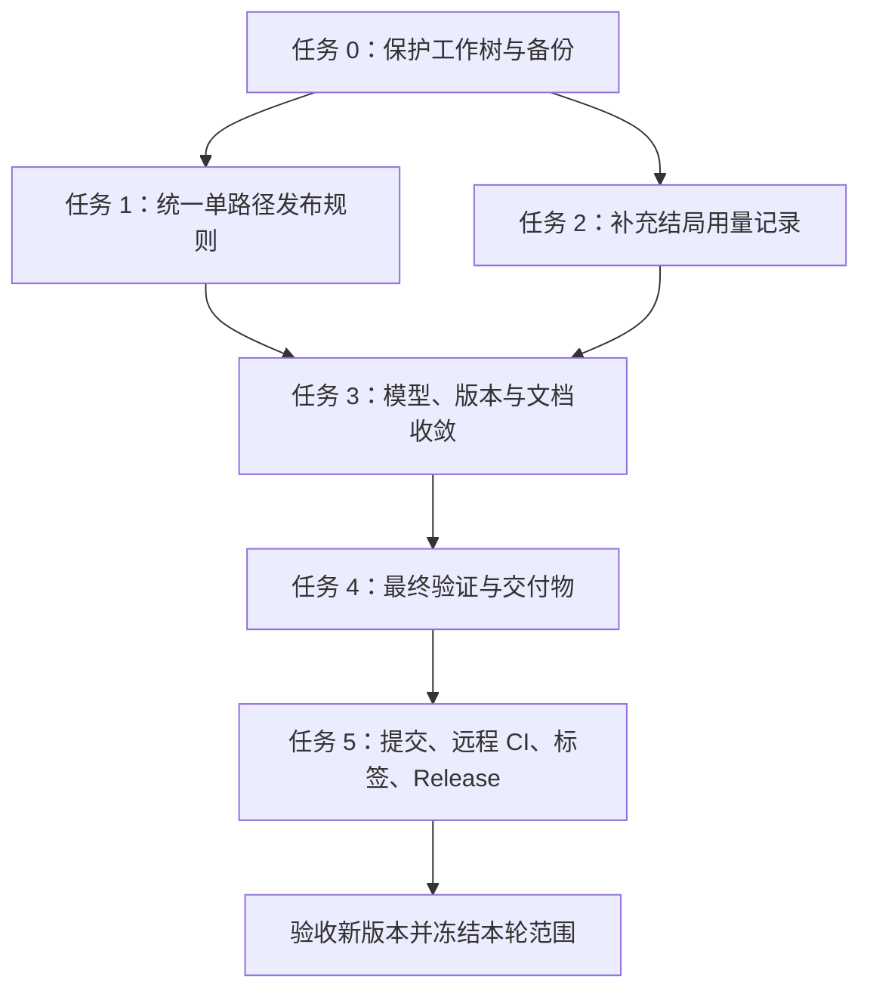

# StoryForge 私人本地版本收尾执行计划

> **执行状态（2026-09-19）：** 本计划已执行完毕。任务 0–4 的本地代码、文档、恢复和分发门禁已记录；任务 5 已完成提交、远程 CI、合并、标签和 GitHub Release。真实模型语义评分、代码签名和干净 Windows 账户安装仍保留为后续人工门禁。

**Goal:** 完成“作者逐幕选择 -> 模型收尾 -> 保存草稿 -> 校验 -> 封存 -> 离线导出”的单路径闭环，补齐模型用量记录，再发布可追溯的私人本地版本。

**Architecture:** 保留 Next.js、SQLite 和现有分支写作结构。按故事版本保存发布类型，并统一解析发布限制；补充结局调用采用独立持久化用量记录，汇入项目指标，不伪装成互动会话任务。

**Tech Stack:** Node.js 24、npm 11、Next.js 16.3.4、React 19、TypeScript、better-sqlite3、Zod、Vitest、Playwright、PowerShell 7。

**Spec:** [作者驱动生成规格](../specs/2026-09-06-author-driven-generation-flow.md)、[现有可靠性路线图](2026-09-08-storyforge-reliability-roadmap.md)，以及本文件明确的收尾行为与验收标准。涉及版本发布类型的调整，以本文件作为下一轮实施设计依据。

## 一、范围与约束

- 私人、本地、单作者、文字优先；不增加登录、公开分享、图片生成或多人协作。
- 每幕生成当前正文和可选方向；作者选一个方向后才生成下一幕；最终由模型收尾。
- 未选择的方向不生成正文，也不写成已经发生的事实。
- 单条完整创作路径可以封存与导出，不强制作者补出第二个结局。
- 多分支作品继续执行原有结构要求；不全局降低 `RELEASE_GRAPH_LIMITS`。
- 空正文、缺少结局、断链、不可达节点、循环及过期修订等现有校验继续有效。
- 保留现有未提交改动、用户项目、数据库和历史标签；不删除或覆盖历史工作。
- 不随意升级依赖或大规模重构；任何新增数据库迁移必须先备份，并验证升级恢复。
- 模型用量记录不保存 API key、prompt、原始响应或故事正文。
- 构建、打包和证据生成串行执行，避免共享构建目录或锁竞争；测试使用隔离数据库。
- 发布新版本前核对既有授权与最终提交；本计划落盘本身不等于执行发布。

## 二、当前基线与证据

以下为 2026-09-18 审查时的事实，实施前必须刷新，不作为未来提交的自动通过证明。

| 项目 | 当前结果 | 解释 |
| --- | --- | --- |
| 人工功能测试 | 用户已反馈“已经测试完”“没问题” | 记录为用户报告的流程验收；不代填逐样本语义评分 |
| 本地版本 | `0.1.7` | 本地已有 `v0.1.7` 标签，不能覆盖重打 |
| 分支 | `codex/branch-writing-v0.1.5` | 有 28 个已跟踪文件未提交改动 |
| Vitest | 86 个文件、433 个测试通过 | 本轮执行 `npm test`，退出码 0 |
| 类型与 lint | 通过 | 本轮执行 `npm run typecheck`、`npm run lint`，退出码 0 |
| 单路径发布复现 | 8 节点、1 结局，返回 `ENDING_MIN_LIMIT / blocking` | 由真实 `materializeInteractivePath` 与 `validateStoryGraph` 在内存中复现 |
| 数据库 | migration 13、integrity ok、可写 | `authoring:doctor` 本轮读取结果 |
| 备份 | stale，最近时间 `2026-09-16T05:03:20.188Z` | 新测试结果需要刷新 checkpoint |
| 模型 | 本地 `doubao-seed-evolving` | 最新三份审阅材料使用 `deepseek-v4-flash`，二者不一致 |
| 远程分支 CI | `23a2aa0` 对应 run `34419170338` 成功 | 不覆盖本地未提交改动 |
| GitHub Release | 最新正式 Release 为 `v0.1.4` | 标签与正式 Release 不是同一个完成状态 |
| 本轮未重跑 | 生产构建、完整 E2E、真实模型评测、分发验证 | 最终门禁必须刷新 |

## 三、执行顺序



任务 1 和任务 2 可独立审查，但涉及迁移、共享文件及验证环境时顺序实施。任务完成必须记录实际命令、退出码和证据；失败不得勾选。

## 任务 0：建立可恢复的执行基线

**涉及文件/数据：** Git 工作树、现有 SQLite、`src/scripts/authoring-db-checkpoint.ts`、`src/scripts/authoring-db-restore-check.ts`。不修改用户数据库业务内容。

- [x] 执行 `git status --short --branch`、`git diff --stat`、`git log -5 --oneline`，记录 HEAD 和已有改动清单，区分已有工作与本计划新增改动。
- [x] 执行 `npm run db:authoring:checkpoint`，记录备份时间、完整性与校验摘要，不在公开文档写入用户数据路径或正文。
- [x] 执行 `npm run db:authoring:restore-check -- --latest`，只在临时副本恢复，确认迁移、完整性及图谱读取通过。
- [x] 执行 `npm run authoring:doctor`，确认数据库 ok、备份 fresh、loopback-only、provider configured。

**交付标准：** 原工作树和用户数据可追溯，迁移前有经过恢复验证的备份。任何恢复失败先处理，不进入数据库改动。

## 任务 1：单路径完成后可以直接发布

**优先级：P1。** 当前落稿只保留一条路径，但发布至少要求两个结局，且落稿会为额外结局预留节点容量。

**主要文件：**

- 新建 `src/lib/authoring/release-policy.ts`：集中定义发布类型和规模限制解析。
- 修改 `src/lib/authoring/repository.ts`：落稿类型、版本复制及额外结局容量判断。
- 修改 `src/lib/authoring/schemas.ts`、`src/lib/authoring/migrations.ts`：版本发布类型的持久化与校验。
- 修改 `src/lib/authoring/validation/service.ts`、`src/lib/authoring/snapshots.ts`、`src/app/api/projects/[projectId]/graph/route.ts`：所有发布相关结构检查使用同一策略。
- 核对 `src/lib/authoring/backup.ts`、`src/lib/authoring/export-html.ts`：导入、导出、复制和快照恢复保留正确策略。
- 测试：`src/__tests__/interactive/materialize-repository.test.ts`、`src/__tests__/authoring/validation/release-gate.test.ts`、`src/__tests__/authoring/snapshots.test.ts`、`src/__tests__/authoring/backup.test.ts`、`e2e/authoring-interactive-flow.spec.ts`、`e2e/authoring-offline-export.spec.ts`。

**接口设计：**

```ts
type ReleaseProfile = "selected_path" | "branching_graph";

function resolveReleaseLimits(
  profile: ReleaseProfile,
  size: { targetNodeCount: number; targetEndingCount: number },
): GraphLimits;

// selected_path: minNodes = 2, minEndings = 1
// branching_graph: 保持现有 minNodes = 8, minEndings = 2
// 两类均保留项目的 maxNodes / maxEndings 以及其他结构检查。
```

发布类型属于故事版本，随快照、复制、恢复和备份保留；不能仅依赖浏览器参数或仍然存在的互动会话。新落稿为 `selected_path`，新结构化版本为 `branching_graph`。旧版本只在有同项目会话落稿关系或已确认的版本继承证据时识别为单路径，不凭节点标题猜测。旧备份没有类型且无可靠证据时保留原多分支规则，并给出可理解提示。

- [x] 先增加回归：完整 8 节点单路径在选定路径策略下通过发布；旧实现会因 `ENDING_MIN_LIMIT` 失败。
- [x] 增加短路径回归：micro 6 幕路径可落稿、封存和导出，避免仅修结局数量后继续被最少 8 节点阻断。
- [x] 增加反向测试：普通多分支版本仅一个结局仍失败；现有未结束、空正文、断链、循环、无效选择、过期修订回归继续通过。
- [x] 实现版本级类型与集中限制解析，统一 repository、图 API、验证服务、编辑器计数和 snapshot 的调用；已清理业务路径中对全局 `RELEASE_GRAPH_LIMITS` 的直接使用。
- [x] 对单路径取消“为未生成结局预留节点”的落稿限制；项目最大节点数仍有效，多分支逻辑保持原约束。
- [x] 覆盖快照恢复、项目复制、删除和现有备份/恢复路径，保证策略随版本保存；未知旧版本无策略时保持原多分支兼容行为。
- [x] 页面编辑器计数和指南明确单路径可直接校验、封存和导出；扩展分支仍是可选操作，不要求凑数。
- [x] 增加 E2E：逐幕选择直到结局 -> 落稿 -> 校验 -> 封存 -> 导出 HTML，不补第二个结局；最终 authoring E2E 为 18/18。

**验证：**

```powershell
npm test -- src/__tests__/interactive/materialize-repository.test.ts src/__tests__/authoring/validation/release-gate.test.ts src/__tests__/authoring/snapshots.test.ts src/__tests__/authoring/backup.test.ts
npm run test:e2e:authoring -- --grep "single-path"
```

新 E2E 用例名称包含 `single-path`。新增策略测试纳入本任务定向验证和最终全量测试。

**交付标准：** 完整单路径无需新增结局即可导出；旧多分支校验不降级；恢复后的行为一致。

## 任务 2：补齐新增结局的模型用量记录

**优先级：P2。** 当前 `/endings/generate` 返回 tokens，但没有写入项目指标所读取的记录。

**主要文件：**

- 新建 `src/lib/authoring/ending-usage.ts`：预留、成功结算和失败记录。
- 修改 `src/lib/authoring/migrations.ts`：新增结局调用表及 project/status 索引，迁移版本按实施时实际末版本递增，不覆盖现有迁移。
- 修改 `src/app/api/projects/[projectId]/endings/generate/route.ts`：调用前后写账，失败路径同样结算。
- 修改 `src/lib/authoring/metrics.ts`、`src/lib/authoring/metrics-contracts.ts`、`src/features/authoring/project-metrics.ts`：统计与展示结局调用。
- 测试：`src/__tests__/authoring/generation/author-ending-route.test.ts`、`src/__tests__/authoring/metrics.test.ts`、`src/__tests__/authoring/migration-safety.test.ts`，新增 `src/__tests__/authoring/ending-usage.test.ts`。

**记录设计：** 每次 provider 调用一个唯一记录；保存项目、版本、来源节点、模型、状态、输出预留量、实际输入/输出、开始/完成时间和脱敏错误类别。状态至少为 `reserved / succeeded / failed / unknown`。开始前持久化预留记录，终态更新必须幂等。超时或无法确认消耗为 `unknown`，不能按零消耗冒充成功。模型调用发生前的参数或修订冲突不计为模型调用。

- [x] 先增加失败回归：一次成功补充结局后，项目 `totalCalls` 增加 1，tokens 与 fake provider 一致；当前项目指标已覆盖。
- [x] 覆盖 provider 超时/网络未知、缺失 usage、provider 报错、结果 schema 失败边界和重复终态结算；未知用量单独展示，不混入确认用量。
- [x] 实现持久化记录，调用结束后先保存账本再返回；错误处理脱敏且保留原始业务错误类别。
- [x] 成功响应但 usage 不完整时保留有效结局，同时记录未知消耗；进程中断留下的预留记录超过 30 分钟后由指标读取回收为 `unknown/LEASE_EXPIRED`。
- [x] 将结局调用加入总调用量、实际 tokens、失败分类和延迟；新增字段同步更新 Zod schema 与 UI，避免响应校验不匹配或重复累加。
- [x] 保持互动会话预算的原有作用域；编辑器结局调用使用阶段 token 上限，不宣称已有项目级统一费用预算。
- [x] 验证迁移备份、重启后指标、项目删除级联清理和未知消耗展示；项目 JSON 备份不作为账本恢复方式，完整账本恢复使用 SQLite checkpoint，并已更新说明。

**验证：**

```powershell
npm test -- src/__tests__/authoring/generation/author-ending-route.test.ts src/__tests__/authoring/ending-usage.test.ts src/__tests__/authoring/metrics.test.ts src/__tests__/authoring/migration-safety.test.ts
```

**交付标准：** 每次补充结局调用均可追踪，已知 tokens 统计准确，未知消耗明确可见，刷新和重启不丢失记录。

## 任务 3：统一验收、模型、版本与文档

**主要文件：** `README.md`、`CHANGELOG.md`、`package.json`、`package-lock.json`、`docs/authoring-user-guide.md`、`docs/release/authoring-release-checklist.md`、`docs/release/authoring-verification.md`、`docs/release/interactive-evaluation-review.md`、`docs/release/github-release-procedure.md`、现有可靠性路线图。

- [x] 将用户本轮“已测试完、没问题”记为人工功能验收，明确由用户反馈，项目 ID 与模型未知时未补写或推断。
- [x] 记录当前 dry-run 运行配置为 `doubao-seed-evolving`；历史 DeepSeek 材料仍单独标为历史/非本轮真实调用证据，没有静默切换模型。
- [x] 保留真实评测未完成状态；fake 测试和一次人工功能反馈没有被写成三组样本四维均达标。
- [x] 文档区分“私人使用功能验收”与“三样本叙事质量目标”，并记录语义评分仍是发布前人工门槛。
- [x] 发布候选版本统一为 `0.1.8`；manifest、lockfile、changelog、包目录和 release evidence 已一致。
- [x] README、使用指南和恢复手册已描述单路径发布和结局用量账本。
- [x] 当前验收结果集中到发布验证记录；旧路线图保留历史事实，不作为本轮通过证据。
- [x] 发布流程已移除固定 DeepSeek 和旧示例版本的强制措辞，要求记录本次实际模型与候选版本。

**交付标准：** 用户验收、自动化验证、模型语义评审和 GitHub 发布分别有明确状态；不存在同名不同内容的版本。

## 任务 4：最终验证与分发证据

**主要文件/产物：** 现有测试与打包脚本、`docs/release/authoring-verification.md`、`output/package/`、`output/release/`。产物不应混入作者数据。

- [x] 在代码冻结后串行执行下列门禁，记录实际结果；陈旧预留回收新增后已重跑受影响测试和最终验证。

```powershell
npm run verify
npm run test:e2e:authoring
npm run db:authoring:smoke
npm run authoring:evaluate -- --provider fake
npm run interactive:evaluate -- --provider fake
npm audit --audit-level=high
npm run package:standalone
npm run release:evidence
npm run package:smoke
```

- [x] 执行本地隔离分发验证，使用专门的新目录；临时根由脚本创建并在通过后清理：

```powershell
$closeoutSmokeRoot = Join-Path $env:TEMP ("storyforge-closeout-" + [guid]::NewGuid().ToString("N"))
pwsh -File scripts/package-smoke.ps1 -Mode Local -Root $closeoutSmokeRoot
```

- [x] `package:smoke` 的 DryRun 与 Local 结果分别记录；Local 已覆盖安装、升级、失败升级、回滚和卸载保留数据。
- [x] 校验包内不含 `.env.local`、SQLite、作者正文、模型原始响应、敏感日志；SBOM、SHA-256、版本号和 evidence manifest 一致。
- [x] 新迁移落地后完成 checkpoint 与临时恢复演练，确认 migration 14 数据可恢复。
- [x] 检查本地开发服务及健康接口，`http://127.0.0.1:3202/api/health` 返回 HTTP 200、版本 `0.1.8`、SQLite 持久化和 provider configured。

**交付标准：** 最终源码和发布产物各自具有对应验证记录；不把其他提交或旧包的结果拼接为本次通过证据。

## 任务 5：提交、远程验证与发布

**主要文件/服务：** Git、`.github/workflows/ci.yml`、GitHub PR/Actions/Release、发布验证记录。

- [x] 审查最终 diff，逐项暂存相关代码、测试和文档；确认未暂存数据、凭据或生成包，不使用无差别清理来获得干净工作树。
- [x] 按功能整理提交，候选提交为 `ff24399`，版本为 `0.1.8`；人工语义评分、签名和干净 Windows 账户安装仍是残余限制。
- [x] 推送候选分支并更新面向 `master` 的 PR #3；CI 已实际触发。
- [x] 精确候选提交 `ff24399` 的 `verify`、authoring E2E、Windows standalone 和 Docker job 全部通过。
- [x] PR #3 已合并，最终 `master` 合并提交为 `f2fec8b`。
- [x] 已基于 `f2fec8b` 创建并推送新的 annotated tag `v0.1.8`；既有 `v0.1.7` 未移动或覆盖。
- [x] 已从 `v0.1.8` 创建 GitHub Release，附 standalone ZIP、ZIP SHA-256、SBOM、standalone 文件清单和 release evidence；标签 CI 的 evidence manifest 报告 `packageFileCount=2023`、`secretsIncluded=false`、`signed=false`。
- [x] 已核对 Release 链接、tag 指向、下载文件、版本号、checksum 和标签 CI：PR https://github.com/Caser-86/storyforge-interactive-narrative/pull/3，CI https://github.com/Caser-86/storyforge-interactive-narrative/actions/runs/35365455851，Release https://github.com/Caser-86/storyforge-interactive-narrative/releases/tag/v0.1.8。

**交付标准：** 可以从 GitHub 下载一个与标签和验证记录一致的版本；发布状态由远程可观察结果证明。

## 四、暂不阻塞私人版本的后续工作

| 项目 | 本轮处理 | 后续触发条件 |
| --- | --- | --- |
| 签名安装器 | 保留 standalone，明确未签名 | 面向其他普通 Windows 用户分发 |
| 干净 Windows 账户安装 | 隔离安装 smoke 不冒充真实账户证据 | 承诺开箱即用安装体验前 |
| 真实手机与读屏验收 | 保留自动化视口和可访问性覆盖，注明实机未验收 | 正式承诺相应设备支持前 |
| 大规模架构重构 | 不纳入本轮 | 有可量化维护问题且不影响收尾时 |
| 项目级统一费用预算 | 本轮先补齐真实调用记录 | 需要统一限制编辑器及所有生成入口费用时 |
| 登录、图片、多人协作 | 不纳入当前产品范围 | 用户明确改变产品定位后 |

## 五、收尾完成定义

- [x] 单路径从开场到模型结局、落稿、封存和离线导出全流程通过（本地 fake provider 端到端证据；真实模型语义质量仍单独门控）。
- [x] 多分支既有规则及恢复行为无回归。
- [x] 补充结局调用的实际和未知消耗可追溯。
- [x] 用户最新数据有 fresh checkpoint，且恢复演练通过。
- [x] 版本、模型、文档、源码、构建产物和验收证据一致。
- [x] 当前提交远程 CI 通过，新标签与 Release 对应同一审核提交 `f2fec8b`。
- [x] 私人版本限制被清楚记录，尚未完成的分发能力没有标为通过。

完成以上项后冻结本轮范围，后续需求进入新版本；新发现的阻断 bug 单独修复并补回归，不用扩展功能替代收尾。

## 六、本轮执行记录

- 代码与测试：`npm run verify` 通过，87 个 Vitest 文件 / 437 个测试；typecheck、lint、生产构建通过。
- 浏览器闭环：`npm run test:e2e:authoring` 通过，18/18；新增单路径用例确认不新增第二结局也可校验、封存和导出。
- 数据恢复：迁移 14；checkpoint 完整性 `ok`，恢复演练为 3 个项目、图谱可读，`authoring:doctor` 为 `ok`、备份 `fresh`、loopback-only、provider configured。
- 离线评测与安全：结构化 fake 3/3、互动 fake 3/3，`npm audit --audit-level=high` 为 0 vulnerabilities；LLM dry-run 为 `doubao-seed-evolving` 且未发网络请求。
- 分发：standalone `0.1.8`、SBOM、SHA-256、脱敏扫描和 Local package smoke 通过；签名仍为 false。
- 人工反馈：作者反馈当前项目已测试完且没有问题；未提供可核对的项目 ID、最终模型和逐样本语义评分，因此未推断或代填真实模型质量门禁。
- 发布收尾：候选提交 `ff24399` 已推送；PR #3 已合并为 `f2fec8b`；`v0.1.8` 标签 CI run `35365455851` 的 verify、authoring E2E、Docker、Windows standalone 和 release evidence 全部成功；GitHub Release 已创建。标签 CI evidence manifest 的最终统计为 `packageFileCount=2023`、`secretsIncluded=false`、`signed=false`。
- 残余人工门禁：真实模型语义评分尚未代填，代码签名和干净 Windows 账户安装仍未完成；它们不被本地自动化或当前 Release 记录冒充为已通过。
